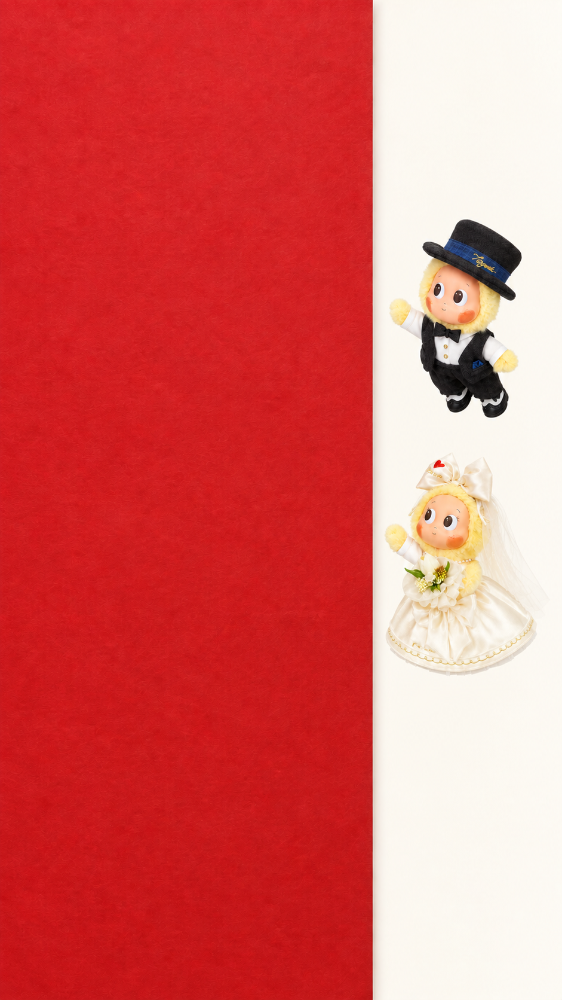

# V10.73 · 完整拉纸转场准备稿

状态：已准备首帧构图草稿、9 秒动作脚本和视频提示词；没有提交 PixVerse 视频生成，没有消耗 PixVerse 积分。网页仍为 V10.71，不部署、不推送。

本版取代 V10.72 仅验证等待/牵手的范围，但保留 V10.72 文件供回溯。

## 首帧构图草稿

这是一张内置 imagegen 生成的动作测试构图，不是最终请柬，不是已经生成的视频。参考源为 ../../versions/v10.71-collar-and-motion/star-couple-reference.jpg；不使用拆分头像、不发送真人婚纱照。原参考图没有修改。

纸页从画面左侧延伸至约 66% 宽度，左边固定、右边可抓取。男孩在右上、女孩在右下，两人朝向纸边，手尚未接触；留出飞近和伸手的空间。右边米白区域是动作测试背景，不是第二页最终设计。

本轮先生成初稿，再针对人物太大、已碰纸边的问题做了一次定向修改，选用第二张。静态检查：恰好两人，帽子/头纱/花朵/项链及领口可见、全身在画内，手与纸有间隙。它是 AI 重构图，不宣称与产品原图逐像素一致；细节和动态中的身份稳定仍需验收。

## 完整 9 秒动作

| 时间 | 行为 | 接触与动作要求 |
|---|---|---|
| 0–1.2 秒 | 两人沿短弧线飞向右侧纸边 | 首帧已在画内，必须有明确靠近过程；眼睛先看抓点，不瞬移 |
| 1.2–2.0 秒 | 男孩抓较高处、女孩抓较低处，短暂蓄力 | 袖口、手腕、手保持连续；手碰到纸后纸才开始动 |
| 2.0–4.8 秒 | 一起将右侧纸边向左拉开 | 左边固定，右边朝镜头轻弯后越过左侧；是一张有弹性的纸页，不是门、窗帘或撕纸；手随抓点同步移动 |
| 4.8–5.5 秒 | 页面已大幅翻开，两人松手 | 露出后方米白平面；男孩先松，女孩紧接松开；轨迹延续惯性，不突然刹停 |
| 5.5–6.7 秒 | 男孩先到画面中部悬停，回望等待 | 女孩从稍低处靠近；眼睛先转、头肩随后，小幅自然漂浮，不循环摆动 |
| 6.7–7.3 秒 | 伸出内侧手、牵住并相视 | 接触后停留一小会；不能跳过接触、凭空多手或花束消失 |
| 7.3–8.8 秒 | 同时向右上方加速飞离 | 牵手不分开；身体先加速，袖口/裙摆/头纱延迟跟随；稀疏金星拖尾不遮住双手 |
| 8.8–9.0 秒 | 人物离场，拖尾消散 | 剩干净的第二层背景，便于后续与真实第二页衔接 |

以上是导演目标，不是模型可保证逐帧执行的结果。把“拉纸”和“等待牵手”同时放入一条视频比仅牵手更复杂，不能承诺一次成功。

## 生成设置与预算门槛

- 建议 PixVerse V6，540P，9 秒，单条，声音关闭，多镜头关闭，比例随竖版首帧。
- 上次实际网页只确认过：账户余额 60，6 秒/540P/无音频/单镜头标价 36 积分。不是本次 9 秒的已确认价格。
- 若保持每秒同价，9 秒推算约 54 积分，但必须以提交前页面实际显示为准；不将估算当作扣费承诺。
- 用户本轮仅授权“准备”。上传此新首帧或点击生成前，先展示首帧与实际费用，并取得用户对单次试做风险的同意。绝不因模型限制自动升档、买会员、充值或批量重试。

## 验收：以下任一失败都不接入网页

1. 包含飞近、抓纸、拉纸、露出后页、等待、牵手、共同飞离全过程；不能省略拉纸。
2. 手抓稳后才拉动；纸固定左边，右边向左翻，不能反向、凭空消失、变成双门或撕成碎片。
3. 头颈、领口、项链、头纱及衣服始终连续；帽子花朵不消失；恰好两个人物。
4. 男孩真的等待、回看，女孩到达后真正牵住，再一起飞离；不穿模、不增加肢体。
5. 目光、肩肘腕、身体和服装形成有因果的先后关系，不以整体图片摇摆冒充关节动作。
6. 星光稀疏且位于人物后方，不能盖住接触错误。
7. 查看早/中/晚关键画面并完整播放。生成成功不等于动作验收通过。

## 与真实请柬合成：尚未实现，不能假定可直接接入

- 首帧故意不用实际请柬文字、姓名或真人照片，避免这些内容被视频模型重画。
- 输出预计是普通不透明视频，不是自动可用的透明角色层；米白背景、红纸和角色需后续分层/遮罩处理。
- 真正首屏仍用原请柬图。要让其像同一张纸被拉开，需要把视频纸面运动与原请柬的网格变形/遮罩对齐，并将人物放在正确前后层；不能直接把空白红纸覆盖原请柬称为完成。
- 当前构图右侧留有米白测试区域，与实际全幅请柬首屏不完全相同。接入前须验证边界、比例和切入帧，不可直接替换首页。
- 第二页实际照片仍由原网页显示；生成中的米白层只是运动测试底板，不代表重新设计第二页。
- 如果样片无法可靠分层或纸面无法对齐，应报告接入不可行，不能靠突然淡出、遮住原请柬或改真人图掩盖。

## 文件

- start-frame-candidate.png：选用的首帧草稿。
- first-frame-v1.png：第一张未选中的构图，留作本版过程记录。
- VIDEO-PROMPT.md：中英文导演说明和待提交英文提示词。
- IMAGE-PROMPTS.md：两次内置生图提示词原文。

按动画技能的接触同步、先接触再施力和动作先后原则编排；按 imagegen 技能保存原件与版本化产物。没有修改 V10.71、love.html、index.html、guest.html，也没有上传 OSS。
