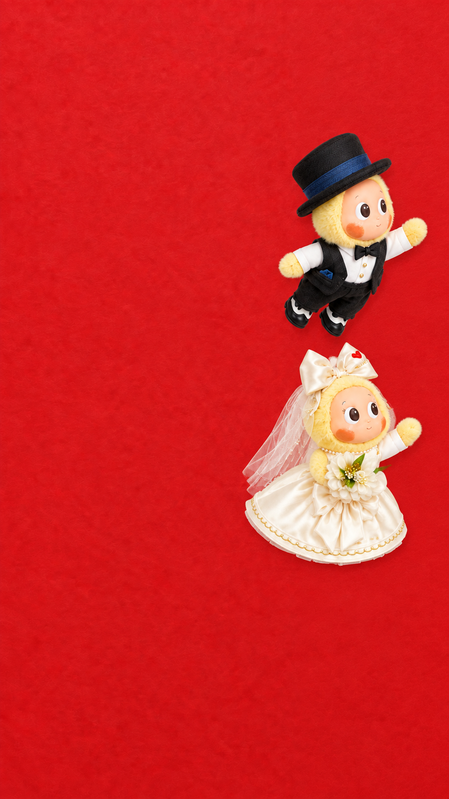

# V10.74 · 连续拉纸与牵手转场准备稿

状态：修正首帧构图与动作脚本；尚未生成视频、未提交 PixVerse、未部署或推送。网页仍维持原版本。V10.73 原样保留。

## 本版修正

- 首帧红纸铺满画面，取消右侧米白条；两人在纸前、右边缘内侧，朝右伸手。
- 方向固定：左边是装订轴，右边是自由边；自由边先向镜头轻弯，再向左翻。不向右开，不撕纸，不变成帘子。
- 松手时人物还在画内；保留惯性，经连续转弯进入已露出的区域，不能从左边瞬移回中间。
- 会合明确为男孩画面左、女孩画面右，不交叉换位。相邻的两只手牵住，停留后才离场。
- 拖尾分阶段处理：靠近时少量；抓纸和牵手时弱化；共同离场时增强；最后留 0.7 秒消散。

## 构图检查

内置 imagegen 编辑了 V10.73 的动作参考图，未编辑真人婚纱照或实际请柬。

静态观察通过：全红无米白条、恰好两人、男上女下、朝右伸手、全身在画内、帽子/领口/头纱/项链/裙摆可见。
静态观察未通过：人物全高约占画高四分之一，比提示词目标 19% 大；与原产品参考相比，帽带刺绣、服装和花朵等细节仍有变化。此图仅确认方向与站位，不是服装完全保真的成品首帧，不能称为“所有问题已经解决”。

## 9 秒导演时间表

时间仅为导演目标，不是视频模型能保证执行的帧级控制。

| 时间 | 动作 | 关键约束 |
|---|---|---|
| 0–0.8s | 右侧画内沿短弧靠近自由边 | 男上女下；看抓点；稀疏短星尾 |
| 0.8–1.5s | 抓紧、弯肘、身体后倾蓄力 | 两个高度分别抓稳，纸才开始运动 |
| 1.5–4.1s | 一起往左拉纸 | 左轴固定；右边向镜头弯、向左翻；手和抓点全程同步 |
| 4.1–4.6s | 画内松手并进入转弯 | 自由边到画面左侧但人物尚未出框时松手；纸延续翻转，人物继续少许左移后柔和转向 |
| 4.6–5.8s | 连续弧线转回已露出的中部空间 | 男孩走较高弧线，女孩走较低弧线；减速再转向，不原地折返，不交叉 |
| 5.8–6.4s | 男孩悬停，回看女孩靠近 | 男孩最终画面左，女孩画面右；女孩追上，不能男孩先飞走 |
| 6.4–7.0s | 相邻手接触、牵稳、相视 | 男孩画面右侧手与女孩画面左侧手相牵；保持一个清楚的接触点，不指令模糊的解剖左右手 |
| 7.0–8.3s | 同步朝右上方加速离场 | 保持牵手；衣服与头纱略滞后；金星只在身后 |
| 8.3–9.0s | 星尾渐隐，留下米白底板 | 不再产生新星；最后清空，无突然截断 |

## 生成与接入门槛

1. 首帧仍需解决人物比例和服饰一致性；未达到直接提交标准。
2. 上次网页仅实测过 540P / 6 秒 / 无音频 / 单镜头 36 积分、余额 60。9 秒的可用性与价格需要提交前重新读取，不能假定支持或按比例扣费。
3. 当前不上传新参考、不点击生成、不充值、不自动重试。实际费用和单次试做风险经用户确认后才提交。
4. 空白红纸不是实际请柬：虽然去掉米白条，纸纹、色调及文字照片仍无法无缝对应真实首屏。生成普通不透明视频不能直接成为透明动画覆盖层。
5. 接入须验证纸面跟踪/网格变形、角色遮罩、首尾帧和第二页衔接；实际姓名文字和真人照片由原网页保持，不能让模型重画。
6. 将来的手机验收还须覆盖点击触发、加载失败、播放拒绝、连续滑动、重复点击、滚动恢复和减少动态效果偏好。当前没有实现或验证这些功能。
7. 动态验收必须完整播放并检查抓纸中段、松手转弯、等待、牵手和尾帧。提示词无冲突不等于动作自然；任一身份/服饰断裂、反向翻纸、手滑离抓点、瞬移、假牵手都不能接入。

## 文件与回撤

- start-frame-study.png：本次方向/构图草稿，非生产资产。
- VIDEO-PROMPT.md：单镜头英文提示词及约束。
- IMAGE-PROMPT.md：内置图像编辑原始提示词与来源。
- 前版：../v10.73-full-paper-prep/，保留未修改；本目录不被 love.html 引用。

动画技能的接触同步原则用于限制手与纸的关系；动作分阶段安排用于消除松手后跳位与仓促离场。imagegen 技能用于版本化编辑并保留生成原件。
